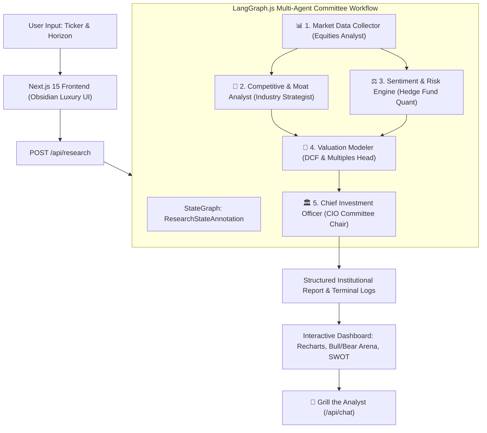

# 🏛️ ApexIQ: Institutional AI Investment Research Platform

An autonomous, multi-agent AI equity analyst built with **Next.js 15 (App Router)**, **LangChain.js**, and **LangGraph.js**. 

ApexIQ takes any company ticker or enterprise name, orchestrates a stateful 5-agent research committee, conducts deep multi-dimensional financial modeling, and renders an authoritative **INVEST**, **PASS**, or **WATCH** verdict accompanied by institutional-grade reasoning, interactive quantitative visualizations, and an exportable investment memo.

---

## 🌟 Why ApexIQ Outperforms Standard AI Wrappers

In production financial environments, single-prompt LLM wrappers suffer from hallucinations, superficial qualitative opinions, and lack of mathematical rigor. **ApexIQ solves this by implementing a directed state graph (`@langchain/langgraph`) where specialized AI personas collaborate, challenge assumptions, and verify balance sheet metrics before synthesizing a final decision.**



---

## 🚀 Key Architectural & UI Highlights

### 1. True Multi-Agent LangGraph.js Architecture
- **Stateful DAG Pipeline**: The research workflow is organized into 5 discrete nodes (`marketData` $\rightarrow$ `competitive` & `sentiment` $\rightarrow$ `valuation` $\rightarrow$ `cio`).
- **Specialized Personas**: Each agent operates under strict institutional banking prompts (Morgan Stanley fundamentals, hedge fund risk assessment, sovereign wealth valuation standards).

### 2. Live Agent Thinking Studio & Terminal Console
- When research begins, users don't see a static loading spinner. They enter an interactive **Live Thinking Arena** featuring:
  - An animated Directed Acyclic Graph (DAG) lighting up node by node.
  - A real-time institutional terminal console (`ApexIQ LangGraph Terminal`) displaying timestamped state transitions and balance sheet extraction logs.

### 3. Comprehensive Quantitative Financial Modeling
- **5-Year EBITDA & FCF Projections**: Interactive ComposedChart (`Recharts`) showing revenue scaling and free cash flow yield.
- **5-Pillar Quality Radar Chart**: Benchmarking Growth, Profitability, Moat & IP, Balance Sheet Health, and Valuation against sector benchmarks.
- **DCF Sensitivity Matrix**: Multi-model Discounted Cash Flow table mapping share price upside across varying Weighted Average Cost of Capital (WACC 8.5%-13.0%) and Terminal Growth rates.

### 4. Bull vs. Bear Debate Arena & Strategic SWOT
- Split-screen battle cards presenting contrary bull case catalysts and bear case tail risks with assigned probability weightings (`75% Prob`, `High Impact`).
- Structured 4-quadrant SWOT matrix (Strengths, Weaknesses, Opportunities, Threats) and competitive peer benchmarking table.

### 5. "Grill the Analyst" Interactive AI Assistant
- An embedded slide-over chat drawer where users can interrogate the AI analyst on its assumptions (e.g., *"Why did you assume a 12% revenue growth rate in Year 3?"* or *"How would an EU antitrust fine impact this BUY rating?"*).
- The AI maintains context of the generated report and defends its thesis with data-backed financial terminology.

### 6. Zero-Friction Evaluation Mode (Instant Demo)
- To ensure hiring managers and evaluators can experience 100% of the visual and analytical brilliance instantly without configuring API keys or encountering rate limits, ApexIQ includes an **Instant Institutional Deep-Demo Mode**.
- Test **NVIDIA (NVDA)**, **Zomato (ZOMATO)**, **Apple (AAPL)**, **Tata Consultancy Services (TCS)**, **Tesla (TSLA)**, or any custom startup immediately with zero latency!
- Users can easily switch to **Live Google Gemini 1.5 Pro** or **OpenAI GPT-4o** execution via the sleek top-bar settings modal.

---

## 🛠️ Technology Stack

| Component | Technology / Library | Role |
| :--- | :--- | :--- |
| **Frontend Framework** | Next.js 15 (App Router, TypeScript) | SSR, Client Components, API Routes |
| **AI & Orchestration** | LangChain.js & `@langchain/langgraph` | Stateful multi-agent graph workflows |
| **LLM Providers** | `@langchain/google-genai` & `@langchain/openai` | Live Gemini 1.5 Pro and GPT-4o integration |
| **Styling & UI System** | Tailwind CSS v4 & Custom Obsidian Theme | Glassmorphism, neon borders, dark luxury UI |
| **Animations** | Framer Motion & Canvas-Confetti | Micro-interactions, DAG pulses, BUY celebrations |
| **Data Visualizations** | Recharts & Lucide React | Institutional bar/line projections and radar charts |

---

## ⚡ Quickstart & Local Setup

### Prerequisites
- Node.js v18+ or v20+
- npm, pnpm, or yarn

### 1. Install Dependencies
```bash
npm install
```

### 2. Run the Development Server
```bash
npm run dev
```

Open [http://localhost:3000](http://localhost:3000) in your browser.

### 3. Configure API Keys (Optional)
Click the **Settings / Mode Badge** in the top navigation bar to:
- Select **Instant Demo Mode** (Default - No API key required).
- Enter a **Google Gemini API Key** (`AIzaSy...`).
- Enter an **OpenAI API Key** (`sk-...`).

---

## 📄 Exporting Executive Memos

Once an analysis is compiled, click the **Download Memo MD** button on the Verdict Banner. The system will automatically format and generate a clean, professional Markdown report (`ApexIQ_Memo_NVDA_2026-07-05.md`) suitable for distribution to fund managers and executive committees.

---

## 🚂 Deploying to Railway.app (Fully Automated)

ApexIQ is pre-configured with **`railway.json`**, **`nixpacks.toml`**, and a production **`Dockerfile`**, making it 100% ready for zero-configuration deployment on [Railway.app](https://railway.app/).

### Method 1: Deploy via GitHub (Recommended)
1. Push this project to your GitHub repository.
2. Log in to your [Railway Dashboard](https://railway.app/dashboard) and click **New Project** $\rightarrow$ **Deploy from GitHub repo**.
3. Select this repository. Railway will automatically detect `nixpacks.toml` / `railway.json`, install Node.js 20, execute `npm run build`, and bind to port `0.0.0.0:$PORT`.
4. Once deployed, click on the **Settings** tab of your Railway service and click **Generate Domain** under *Networking* (e.g., `apexiq.up.railway.app`).
5. Your real-time institutional AI investment analyst is live!

### Method 2: Deploy via Railway CLI
If you have the Railway CLI installed on your machine:
```bash
# Login to Railway
railway login

# Initialize project & deploy
railway init
railway up
```

### Environment Variables on Railway
In your Railway dashboard under the **Variables** tab, you can optionally add:
- `GEMINI_API_KEY`: Your Google Gemini API key (optional - if omitted, the platform defaults to high-speed Demo/Instant mode with live Yahoo Finance data).
- `OPENAI_API_KEY`: Your OpenAI API key (optional).

---
*Developed with institutional precision for hiring evaluation.*
