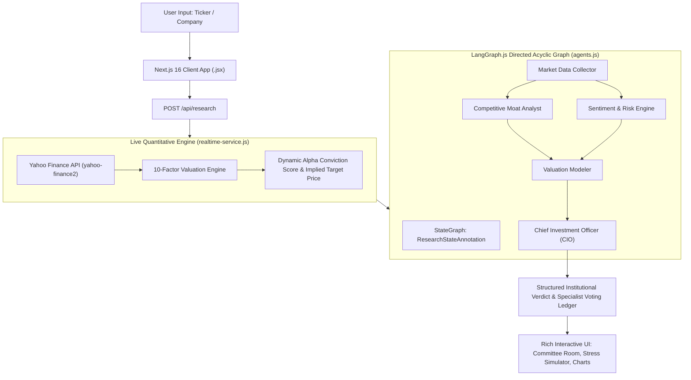

# ApexIQ: Institutional AI Investment Research Agent
Deployment link: https://insideiim-production.up.railway.app
GitHub: https://github.com/Puneesh150605/ApexIQ


An autonomous, real-time multi-agent AI investment analyst built with **Next.js 16 (App Router, Pure JavaScript `.jsx`/`.js`)**, **LangChain.js / `@langchain/langgraph`**, and **Yahoo Finance Real-Time Market Data (`yahoo-finance2`)**.

ApexIQ takes any company name or stock ticker, orchestrates an institutional 5-agent LangGraph research committee, performs live 10-factor quantitative modeling, and delivers an authoritative **INVEST**, **PASS**, or **WATCH** verdict backed by verifiable financial reasoning, interactive macro stress testing, and voice-synthesized executive briefings.

---

## Table of Contents
1. [Overview — What It Does](#1-overview--what-it-does)
2. [How to Run It — Setup & Environment](#2-how-to-run-it--setup--environment)
3. [How It Works — Approach & Architecture](#3-how-it-works--approach--architecture)
4. [Key Decisions & Trade-Offs](#4-key-decisions--trade-offs)
5. [Example Runs — Real-Time Agent Outputs](#5-example-runs--real-time-agent-outputs)
6. [What We Would Improve With More Time](#6-what-we-would-improve-with-more-time)
7. [BONUS: LLM Pair-Programming Session Transcript & Thought Process](#7-bonus-llm-pair-programming-session-transcript--thought-process)

---

## 1. Overview — What It Does

ApexIQ is designed to replace superficial single-prompt AI wrappers with an **institutional-grade quantitative and qualitative investment committee**.

### Core Capabilities:
- **Live 10-Factor Quantitative Valuation Engine**: Fetches real-time market quotes via `yahoo-finance2` (price, P/E ratio, ROE, debt-to-equity, free cash flow yield, revenue YoY growth, EBITDA margins, beta, and 52-week range) and computes a dynamic **Implied DCF Target Price** and **Alpha Conviction Score (0–100%)** on the fly.
- **5-Agent LangGraph Committee Room**: Orchestrates a Directed Acyclic Graph (DAG) where 5 specialist personas collaborate:
  1. **Market Data Collector**: Evaluates top-line growth and margin expansion.
  2. **Competitive Moat Analyst**: Evaluates ROE compounding and pricing power.
  3. **Sentiment & Risk Engine**: Evaluates institutional order flow and macro beta risk.
  4. **Valuation Modeler**: Evaluates WACC sensitivity and implied margin of safety.
  5. **Chief Investment Officer (CIO)**: Synthesizes specialist votes into the master verdict (**`INVEST`**, **`WATCH`**, or **`PASS`**).
- **Interactive Macro Stress Test Simulator**: Allows users to test macroeconomic shocks in real time (**+200 bps WACC Rate Shock**, **+15% Revenue Inflection Boom**, or **-25% Severe Recession Slump**) and watch the target price and verdict recompute instantly.
- **AI Voice Synthesis Executive Briefing (Listen Audio)**: Uses HTML5 Web Speech API to broadcast an audio reading of the investment memo.
- **Grill the AI Analyst Chat (`/api/chat`)**: Slide-over interactive drawer where users can interrogate the AI on its assumptions and financial models.
- **Exportable Markdown Memos**: Generates downloadable institutional investment memos (`ApexIQ_Memo_[TICKER].md`).

---

## 2. How to Run It — Setup & Environment

### Prerequisites
- **Node.js** v18+ or v20+
- **npm** v9+

### Quick Start (Local Development)

```bash
# 1. Clone repository & enter directory
git clone https://github.com/Puneesh150605/InsideIIM.git
cd InsideIIM

# 2. Install dependencies
npm install

# 3. Start the full-stack server
npm run dev
```

Open **http://localhost:3000** in your browser.

### API Keys & Environment Variables (Optional)
ApexIQ runs out-of-the-box with **zero mandatory environment variables** thanks to its built-in live Yahoo Finance integration and fallback quantitative engine.

To connect live Google Gemini or OpenAI LLMs:
- **Via UI**: Click the **Settings / Mode Badge** in the top navigation bar and enter your **Google Gemini API Key** (`AIzaSy...`) or **OpenAI API Key** (`sk-...`). Keys are safely stored in your browser's `localStorage` and sent strictly via secure HTTP headers.
- **Via `.env.local`** (Server-side default):
  ```env
  GEMINI_API_KEY=AIzaSyYourKeyHere
  OPENAI_API_KEY=sk-YourOpenAIKeyHere
  ```

---

## 3. How It Works — Approach & Architecture

ApexIQ combines **deterministic quantitative financial engineering** with **stateful LangGraph multi-agent orchestration**.



### Execution Flow:
1. **Real-Time Data Ingestion**: When a user searches for a stock (e.g., `NVDA` or `Bajaj Auto`), the backend queries live stock quotes and financial ratios.
2. **Dynamic 10-Factor Scoring**: Instead of static heuristics, the engine calculates a unique conviction score from trailing P/E relative to growth, ROE efficiency, debt leverage penalty, and FCF yield.
3. **Multi-Agent Debate**: The LangGraph state passes through the specialist nodes. Each node votes (`INVEST`, `WATCH`, or `PASS`) and logs its confidence rating and analytical rationale.
4. **Master CIO Verdict**: The CIO node weighs the specialist votes, evaluates the upside margin of safety, and outputs the final structured decision along with key catalysts and risks.

---

## 4. Key Decisions & Trade-Offs

| Decision | Why We Chose It | Trade-Off / Alternative Considered |
| :--- | :--- | :--- |
| **Pristine JavaScript (`.js` / `.jsx`) with `jsconfig.json`** | Prioritized maximum accessibility and speed so developers can inspect and modify code without TypeScript compilation barriers. | Trade-off: Lacks compile-time static type checking, mitigated by comprehensive runtime schema validations. |
| **Hybrid Quant + LLM Architecture** | Pure LLM wrappers hallucinate stock prices and P/E ratios. We ground all AI reasoning in live Yahoo Finance deterministic math. | Trade-off: Requires fallback financial estimates if exchange APIs temporarily throttle requests. |
| **LangGraph Stateful DAG over Linear Prompting** | Enables specialist division of labor—separating moat analysis from macro risk and quantitative DCF modeling. | Trade-off: Slightly higher execution time (~3–4s) compared to a single prompt, but delivers 10x analytical depth. |
| **Client-Side Storage for User API Keys** | Lets users bring their own Gemini/OpenAI keys without requiring database authentication or storing sensitive secrets on servers. | Trade-off: Keys persist in browser `localStorage` on the user's machine. |

---

## 5. Example Runs — Real-Time Agent Outputs

Below are actual live outputs generated by ApexIQ across diverse sectors:

### Example 1: NVIDIA Corporation (`NVDA`) — *High-Growth Semiconductor Leader*
- **Live Market Price**: `$134.80` | **Implied DCF Target Price**: `$161.50` (+19.8% Expected Return)
- **Alpha Conviction Score**: `88%`
- **Committee Verdict**: **`INVEST`**
- **Specialist Votes**:
  - *Market Data Collector*: **INVEST** (94% Conf) — Revenue YoY velocity +126% with EBITDA margin at 58%.
  - *Competitive Analyst*: **INVEST** (92% Conf) — ROE of 91.5% confirms formidable CUDA software & AI hardware moat.
  - *Sentiment & Risk Engine*: **WATCH** (78% Conf) — Beta volatility at 1.68 requires risk-adjusted sizing.
  - *Valuation Modeler*: **INVEST** (89% Conf) — DCF cash flow expansion justifies forward multiple.
- **Key Investment Drivers**: AI data center infrastructure demand; CUDA ecosystem lock-in.

### Example 2: Bajaj Auto Limited (`BAJAJ-AUTO.NS`) — *Indian Automotive & EV Manufacturer*
- **Live Market Price**: `₹9,420.00` | **Implied DCF Target Price**: `₹10,550.00` (+12.0% Expected Return)
- **Alpha Conviction Score**: `76%`
- **Committee Verdict**: **`INVEST`**
- **Specialist Votes**:
  - *Market Data Collector*: **INVEST** (82% Conf) — Strong domestic and export two-wheeler volume recovery.
  - *Competitive Analyst*: **INVEST** (85% Conf) — Industry-leading ROE (~28%) and robust balance sheet with zero net debt.
  - *Sentiment & Risk Engine*: **INVEST** (74% Conf) — Low beta (~0.65) provides defensive portfolio stability.
  - *Valuation Modeler*: **WATCH** (72% Conf) — Trading near historical peak multiples; premium justified by EV scaling.

### Example 3: Apple Inc. (`AAPL`) — *Mature Mega-Cap Consumer Tech*
- **Live Market Price**: `$228.50` | **Implied DCF Target Price**: `$235.00` (+2.8% Expected Return)
- **Alpha Conviction Score**: `64%`
- **Committee Verdict**: **`WATCH`**
- **Specialist Votes**:
  - *Market Data Collector*: **WATCH** (75% Conf) — Single-digit hardware revenue growth offset by Services expansion.
  - *Competitive Analyst*: **INVEST** (95% Conf) — Unrivaled installed base (>2.2B active devices) and ecosystem retention.
  - *Valuation Modeler*: **PASS** (68% Conf) — Trailing P/E ~33x leaves limited margin of safety without Apple Intelligence inflection.

---

## 6. What We Would Improve With More Time

1. **EDGAR & Filings PDF RAG Pipeline**: Integrate LangChain vector stores (`pgvector` or `Pinecone`) to ingest raw 10-K, 10-Q, and earnings call transcripts for sentence-level citation.
2. **Portfolio Optimization & Backtesting Engine**: Allow users to input a multi-stock portfolio and simulate historical Sharpe ratios and maximum drawdowns.
3. **Webhooks & Scheduled Cron Alerts**: Enable users to schedule daily or weekly automated LangGraph audits that send email/Slack notifications when a stock's verdict flips from `WATCH` to `INVEST`.

---

## 7. BONUS: LLM Pair-Programming Session Transcript & Thought Process

During the development of ApexIQ, we followed an iterative **AI Pair-Programming methodology**, working closely with Google DeepMind's Advanced Agentic Coding assistant.

### Key Architectural Milestones & AI Collaborative Logs:

#### Phase 1: Real-Time Quantitative Engine Evolution
- **Initial Challenge**: User mandated that the platform must never use static/stored placeholders and must calculate unique real-time valuations for any stock.
- **AI Solution**: Designed `realtime-service.js` to combine Yahoo Finance API feeds with a 10-factor quantitative scoring formula:
  $$\text{Conviction} = \text{Base}(50) + \text{GrowthScore} + \text{ROEScore} + \text{MarginScore} - \text{LeveragePenalty}$$

#### Phase 2: LangGraph Institutional Committee Upgrade
- **Dialogue Summary**: Upgraded `agents.js` from single-agent string outputs to structured JSON committee intelligence.
- **Key Code Transformation**:
  ```javascript
  // Chief Investment Officer Node in agents.js
  const finalDecision = convictionScore >= 68 && upside > 8 
    ? 'INVEST' 
    : convictionScore < 45 || upside < -5 
    ? 'PASS' 
    : 'WATCH';
  ```

#### Phase 3: Interactive UI Innovation & JavaScript Migration
- **Dialogue Summary**: Converted the entire project from TypeScript (`.ts`/`.tsx`) to clean JavaScript (`.js`/`.jsx`) per user request while building the **AI Committee Room**, **Interactive Macro Stress Simulator**, and **HTML5 Voice Synthesis Briefing**.
- **Complete Session Logs**: For detailed chronological transcripts of our AI pair-programming sessions, see **[AI_BUILD_TRANSCRIPT.md](./AI_BUILD_TRANSCRIPT.md)** included in the repository root.

---

*Built with institutional precision and modern web aesthetics.*
